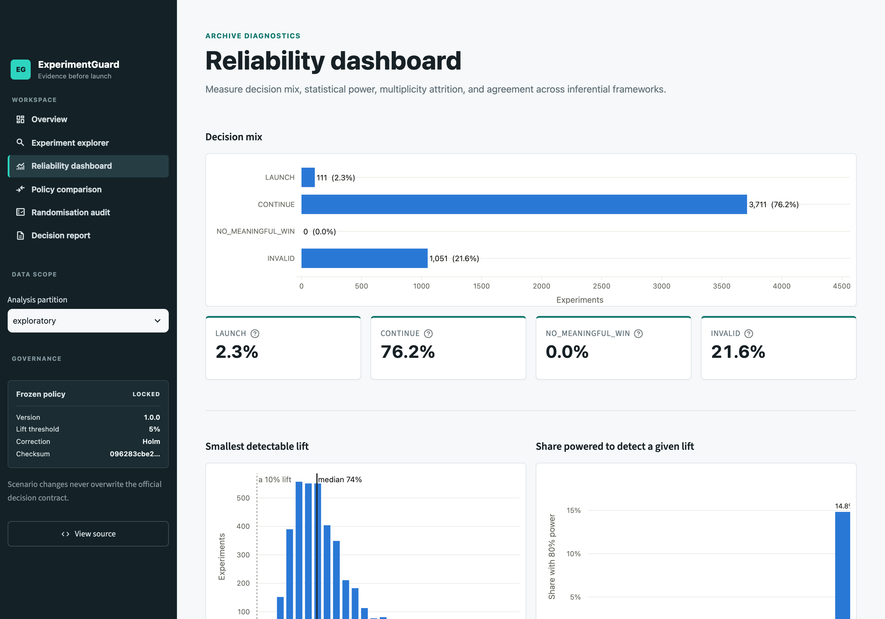

# ExperimentGuard

**A/B-test reliability and experimentation decision platform.**

ExperimentGuard evaluates the [Upworthy Research Archive](https://osf.io/jd64p/) — 32,487
fielded headline experiments, including a documented period of unreliable randomisation — and
returns a governed decision for each one: **LAUNCH**, **CONTINUE**, **NO_MEANINGFUL_WIN** or
**INVALID**.

It exists to stop a specific, common failure: shipping a change because one variant showed a
higher conversion rate, when the experiment never had the power to tell.

---

## Staged evaluation: exploratory → confirmatory → holdout

The archive ships three mutually exclusive partitions so that a decision policy can be frozen
*before* it is graded. ExperimentGuard honours that design, and the three stages mean different
things:

| Stage | Partition | Experiments | Role | Status |
|---|---|---|---|---|
| 1. Development | `exploratory` | 4,873 | All thresholds and rules were chosen here | Used freely |
| 2. Validation | `confirmatory` | 22,743 | The **frozen** policy applied unchanged | Evaluated once |
| 3. Final evaluation | `holdout` | 4,871 | Opened **once**, never used for tuning | Evaluated 2026-09-23 |

### Stage 1 → 2: the frozen policy generalises

The policy was developed and frozen on `exploratory`, then applied without modification to the
held-back `confirmatory` partition:

| Metric | Exploratory (4,873) | Confirmatory (22,743) |
|---|---|---|
| CONTINUE | 76.15% | 76.09% |
| INVALID | 21.57% | 21.58% |
| LAUNCH | 2.28% | 2.33% |
| NO_MEANINGFUL_WIN | 0.00% | 0.00% |
| Median minimum detectable effect | 74.3% | 73.3% |

That agreement is the point of the discipline: thresholds were not tuned until the answer looked
good, and a policy frozen on one partition reproduces itself on one it had never seen.

### Stage 3: holdout

<!-- HOLDOUT-RESULTS -->
**Evaluated once, on 2026-09-23, using the policy frozen in commit `44b6911`** (SHA-256
`096283cbe23ba8af…`). The policy was not modified before, during or after this run, and the
partition will not be evaluated again. The full record — timestamp, command, checksum, output and
metrics — is in [`policy/HOLDOUT_LOG.md`](policy/HOLDOUT_LOG.md).

| Metric | Exploratory (4,873) | Confirmatory (22,743) | Holdout (4,871) |
|---|---|---|---|
| CONTINUE | 76.15% | 76.09% | 75.90% |
| INVALID | 21.57% | 21.58% | 21.74% |
| LAUNCH | 2.28% | 2.33% | 2.36% |
| NO_MEANINGFUL_WIN | 0.00% | 0.00% | 0.00% |
| Unreliable randomisation | 21.55% | 21.58% | 21.74% |
| Median minimum detectable effect | 74.3% | 73.3% | 75.2% |

The frozen policy reproduces itself on a partition it had never seen: every decision rate lands
within 0.3 percentage points of the development partition, and the derived randomisation flag
holds at 21.7% against the authors' published ~22%.

Read honestly, this is a **null-ish result for the archive, not a flattering one**. The holdout
confirms what the first two partitions implied: with a median detectable lift of 75.2%, these
experiments overwhelmingly cannot resolve the effects they were run to measure, so 75.9% land in
CONTINUE and only 2.4% clear the bar to launch. The platform is doing its job by declining, but
the underlying archive remains mostly unable to answer its own question — and the marginally
*higher* MDE here (75.2% vs 74.3%) means the holdout is, if anything, slightly less informative
than the partition the policy was built on.
<!-- /HOLDOUT-RESULTS -->

---

## What the archive actually shows

The typical experiment runs ~3,000 impressions per arm at ~1.5% CTR. At that size the smallest
reliably detectable lift is **tens of percent** — far beyond the single-digit improvements teams
actually ship for. Most of this archive cannot answer its own question.

**`NO_MEANINGFUL_WIN` is never reached, and that is a finding rather than a bug.** Ruling *out* a
worthwhile effect also demands precision the archive does not have. Tests confirm the engine
reaches that state on large samples (n = 1,000,000); the data simply never gets there.

### A phrasing this project is careful about

When ExperimentGuard declines to launch, the evidence was **insufficient under the stated
policy**. That is not a claim that the effect is zero. Failing to reject a null hypothesis is not
proof that nothing happened, and no headline number here says otherwise.

---

## Randomisation audit

In June 2024 the archive's authors published a
[critical update](https://upworthy.natematias.com/2024-06-upworthy-archive-update.html): a
suspected **Cloudflare cache misconfiguration between 2013-06-25 and 2014-01-10** made assignment
behave like block randomisation over time rather than assignment at the individual level. They
found possible issues with ~22% of tests and discourage causal inference from that portion.

**The update states a flag column was added to the dataset. It was not.** Every public OSF file is
still the 2020/2021 vintage with no such column, and the GitHub repository contains no dataset
files at all. ExperimentGuard therefore *derives* the flag from the documented window — and
validates the derivation against the authors' own published figure:

| Check | Value |
|---|---|
| Authors' published estimate | ~22% |
| ExperimentGuard derived | 21.60% (7,016 of 32,487) |
| Exploratory / confirmatory / holdout | 21.55% / 21.58% / 21.74% |

This is the single most important correctness check in the project. If an updated file ever ships
the column, `flag_cache_window` in `src/experimentguard/stats/validity.py` is the one call site to
replace.

**Sample ratio mismatch is reported as a diagnostic, never as a verdict.** Neither the intended
allocation nor each arm's active duration is recorded, so imbalance cannot by itself prove broken
randomisation — the authors say the analysis "can't prove it either way". Invalidity comes from
the documented window; imbalance is charted alongside it, including the imbalance-by-hour pattern
that led the authors to the cache glitch.

---

## The frozen statistical policy

The governed contract lives in `policy/frozen_policy.yml`, checksummed in
`policy/frozen_policy.sha256` and asserted by `tests/test_frozen_policy.py`.

| Parameter | Value | Why |
|---|---|---|
| `practical_threshold` (θ) | 0.05 | A launch must clear a *meaningful* lift, not merely differ from zero |
| `alpha` | 0.05 | Family-wise error rate |
| `multiplicity_method` | `holm` | Family = comparisons **within one experiment** |
| `require_omnibus_gate` | `true` | Gatekeeping 2×K contingency test across all arms |
| `omnibus_alpha` | 0.05 | |
| `cache_window_start` / `_end` | 2013-06-25 / 2014-01-10 | The authors' documented unreliable period |
| `power_target` | 0.80 | For MDE and required-sample reporting |
| `prospective_lifts` | 0.05, 0.10, 0.20, 0.50 | Prospective power only |
| `bayes_prior_alpha` / `_beta` | 1.0 / 1.0 | Beta(1,1) conjugate prior |

### Decision rules

1. **Validity gate.** Experiments starting inside the cache window are `INVALID`, as are integrity
   failures, fewer than two usable arms, and all-zero-click experiments.
2. **Gatekeeping omnibus** across all arms on the 2×K table of clicks and non-clicks. This is a
   gatekeeping procedure, **not closed testing** — it does not test every intersection hypothesis,
   and no such error control is claimed.
3. **Every ordered pair of arms** is tested against H₀: RR ≤ 1 + θ, one-sided.
4. **Holm adjustment** across that within-experiment family.
5. **`LAUNCH` only when one arm beats every other arm.** The archive has no control group — its
   authors say so — so beating one nominated reference arm would establish nothing.

### Design choices that prevent common errors

- **The reference arm is display-only.** Earliest-created, tie-broken by `arm_id`. It carries no
  causal status and gates no decision.
- **Practical significance is a hypothesis, not a point estimate.** Checking whether an estimate
  happens to clear θ would not establish a meaningful improvement.
- **Reported intervals are descriptive.** The gate is the multiplicity-adjusted test; an
  unadjusted interval is never presented as a family-wise bound.
- **Observed power is absent by construction.** Post-hoc power is a monotone transform of the
  p-value, so gating on it is circular (Hoenig & Heisey, *The Abuse of Power*, 2001). A test
  asserts no decision field depends on such a quantity.
- **Changing headline *and* image limits attribution, not validity.** The randomised unit is the
  package, so the experiment still says which package to ship. It carries an
  `ATTRIBUTION_LIMITED` warning.
- **Zero-click arms make the risk ratio non-estimable.** Flagged `RR_NOT_ESTIMABLE`, fall back to
  an absolute-difference interval plus Fisher's exact test, and can never support a launch.
- **`INVALID` experiments stay in the warehouse.** They are ~22% of the archive and its most
  important quality signal, excluded from *inferential* comparisons via
  `is_inferentially_eligible` rather than dropped.

### The Bayesian cross-check, and two numerical traps

The posterior quantity is P(RR > c) = ∫₀^(1/c) pdf_R(r) · (1 − cdf_T(c·r)) dr with Beta(1,1)
priors. Two implementations fail *silently*, and both are pinned by regression tests:

1. `∫ pdf_T(x)·cdf_R(x) dx` computes P(T > R) — the c = 1 case. It returns the **same number for
   every threshold**, ignoring θ entirely.
2. Plain adaptive quadrature over `[0, 1/c]` returns **0.0 where the true value is 1.0** at
   n = 200k, because its abscissae miss a concentrated posterior.

ExperimentGuard integrates over the reference posterior's effective support with 64-node
Gauss-Legendre quadrature, validated against a 2,000,000-draw Monte Carlo across sample sizes from
3×10³ to 2×10⁶, near-null cases and zero-click arms in either position — worst deviation
**4×10⁻⁴**. The node count was chosen by measurement: 48 nodes already agree with a 256-node
reference to 3×10⁻¹⁴.

---

## Test coverage

| Suite | Focus |
|---|---|
| `test_frequentist.py` | Wilson interval vs closed form; omnibus as a *contingency* test; threshold-test directionality; zero-click non-estimability |
| `test_bayesian.py` | Both traps reproduced; Monte-Carlo agreement across 7 parameter regimes × 3 thresholds |
| `test_power.py` | MDE validated **by simulation** (empirical rejection rate ≈ 0.80); no observed-power function exists |
| `test_multiplicity.py` | Holm vs hand-computed procedure; BH against the Benjamini–Hochberg (1995) worked example |
| `test_validity.py` | Cache-window boundaries; SRM as diagnostic only; attribution ≠ invalidity |
| `test_decision.py` | Beating the reference arm alone does **not** launch; omnibus gate; θ sensitivity |
| `test_policies.py` | ONE / NONE / MULTIPLE tri-state; agreement denominators |
| `test_report.py` | Governance context, HTML escaping, self-containment |
| `test_frozen_policy.py` | **Checksum integrity**; scenario policies cannot forge frozen status |
| `test_partition_discipline.py` | No default code path reads the holdout |
| `smoke_pipeline.py` | End-to-end on a committed 93-row fixture; 10 invariants |

Reference values come from closed forms, published worked examples or simulation — not from the
module under test.

---

## Performance

The Newcombe score interval was consuming **1.26 ms of every 1.36 ms comparison** and then being
discarded on the estimable path — it is only needed as the zero-click fallback. Making it lazy cut
a full-archive run from roughly **2.5 hours to ~15 minutes**.

The change was verified to be performance-only: `exploratory` re-ran to **bit-identical** results
(CONTINUE 3,711 / INVALID 1,051 / LAUNCH 111, median MDE 74.3%).

---

## Architecture

```text
OSF CSVs ──ingest──> DuckDB raw_packages      (Pandera-validated, arm_id, partition)
                          │
                 dbt: staging → intermediate
                          ▼
                    analyze  (all-pairs tests, Holm, ratio CIs, power, Bayesian)
                          ▼
                 analysis_* tables (dbt sources)
                          │
                    dbt: marts (star schema)
                    ╱                    ╲
            Streamlit app          Parquet → Power BI
```

**Stack** — Python 3.12 · DuckDB · dbt Core (dbt-duckdb) · pandas/NumPy · SciPy/statsmodels ·
Pandera · Streamlit · Plotly · pytest · Ruff · Docker · GitHub Actions.

### Notes on the data

The archive has no package/arm id column, and `slug` is not unique (22,334 distinct across 22,666
exploratory rows). A stable `arm_id` is hashed from `(source_file, source_row_number, test_id)`.
The unnamed leading column is a *global* row number spanning the whole archive (0…150,816), which
both makes a sound hash input and independently corroborates the 150,817-package total.

`created_at` mixes fractional and whole-second timestamps, so parsing is pinned to ISO8601 —
inference picks the wrong format and fails partway through the file.

---

## Reproducible commands

```bash
make setup                 # conda env, Python 3.12
conda activate experimentguard

make ingest                # ~95 MB from OSF → DuckDB; asserts 32,487 / 150,817
make build                 # analyze (exploratory + confirmatory), then dbt marts + tests
make test                  # pytest
make export                # Power BI star schema → exports/
make app                   # Streamlit at http://localhost:8501

ruff check .
ruff format --check .
```

Expected results:

| Check | Expected |
|---|---|
| Distinct tests ingested | 32,487 |
| Packages ingested | 150,817 |
| pytest | 115 passed |
| dbt | PASS=50, ERROR=0 |
| Ruff lint + format | clean |

The holdout is **not** part of `make all`:

```bash
make holdout               # once only; records to policy/HOLDOUT_LOG.md
```

Docker:

```bash
docker compose up --build  # app on :8501, warehouse mounted from ./data
```

### Vercel deployment

Vercel builds `Dockerfile.vercel`, which downloads the immutable
[`dashboard-data-v1`](https://github.com/meetsutariya4448/ExperimentGuard/releases/tag/dashboard-data-v1)
release artifact and verifies its SHA-256 before adding it to the image. The artifact contains
only the seven analytics marts used by the application; raw archive and pipeline-intermediate
tables are excluded.

To reproduce a future dashboard artifact after running the full pipeline:

```bash
make dashboard-warehouse
```

The hosted container is read-only and starts Streamlit on Vercel's `$PORT`. The regular
`Dockerfile` and `docker-compose.yml` remain the local development path with `./data` mounted as
a volume.

## The application



Screenshots of every page are in [`docs/screenshots/`](docs/screenshots/), captured from the
running app via Playwright against the real warehouse:

| Page | Screenshot |
|---|---|
| Overview | `01-overview.png` |
| Experiment explorer | `02-experiment-explorer.png` |
| Reliability dashboard | `03-reliability-dashboard.png` |
| Policy comparison | `04-policy-comparison.png` |
| Randomisation audit | `05-randomization-audit.png` |
| Decision report | `06-decision-report.png` |

Automated verification is `streamlit.testing.v1.AppTest`, which executes all six pages headlessly
and fails on any exception. Plain headless-Chrome `--screenshot` captures only Streamlit's
pre-hydration skeleton, because `--virtual-time-budget` advances timers but not the real
websocket I/O the app needs; Playwright waits on actual network idle, which is why it works.


- **Overview** — headline reliability findings and how a decision is reached.
- **Experiment explorer** — search 32,487 experiments; drill into per-arm CTR with Wilson
  intervals, the all-pairs comparison matrix, and prospective power.
- **Reliability dashboard** — decision mix, MDE distribution, share adequately powered,
  multiplicity attrition, frequentist/Bayesian agreement.
- **Policy comparison** — the naive rule (computed here), the archive's `first_place` and `winner`
  columns, and ExperimentGuard, with NONE/MULTIPLE shown as first-class outcomes.
- **Randomisation audit** — reproduces the imbalance-over-time and imbalance-by-hour evidence.
- **Decision report** — downloadable HTML, CSV and JSON, carrying both the official and any
  scenario decision plus the policy checksum.

### Why the policies are modelled separately

The archive documents `first_place` as information shown to editors and `winner` as what editors
ultimately selected. Neither is documented as an automatic highest-CTR rule, and the data agrees:
per experiment, `winner` is **NONE for 76.4%**, ONE for 23.5%, MULTIPLE for 11; `first_place` is
NONE for 365. So the naive rule is computed from observed rates, all four policies are compared
separately, and no policy is ever forced to produce a winner. Agreement rates always print their
denominator.

The chart palette is pinned to a light surface (`.streamlit/config.toml`) because the categorical
slots, the two-series audit pair and the CVD/contrast checks were all validated against that
surface.

---

## Power BI

Power BI Desktop is Windows-only and this project was built on macOS, so the deliverable is the
modelled star schema plus a documented semantic model rather than an unverifiable `.pbix`.
`make export` writes Parquet; `powerbi/SEMANTIC_MODEL.md` specifies grain, relationships
(including the inactive second path from `fct_arm_comparison` to `dim_arm`) and the modelling rules
that keep the statistics honest; `powerbi/measures.dax` supplies the measures, several of which
exist specifically to prevent invalid aggregation — never average a risk ratio, never force a
winner, keep INVALID visible.

---

## Limitations

- **The randomisation flag is derived, not supplied.** The authors' update says a column was added;
  it is absent from the public files. Derived from the documented window and validated against
  their ~22%.
- **SRM cannot prove non-randomisation** — the authors say so themselves.
- **The reference arm has no causal status** and drives no decision.
- **Winner's curse** — selecting the best arm biases its uplift upward. The beats-all-arms
  requirement and the θ-threshold hypothesis mitigate acting on it.
- **CTR is not conversion** — these are headline click-through tests. The platform is
  metric-agnostic, but the archive's effect sizes should not be read as feature-launch effects.
- **Partition discipline is a process claim** — `policy/HOLDOUT_LOG.md` is the evidence.

## Licence and attribution

The Upworthy Research Archive is published by Cornell University under CC BY 4.0. Matias, J.N.,
Munger, K., Aubin Le Quere, M., & Ebersole, C. (2021). *The Upworthy Research Archive, a time
series of 32,487 experiments in U.S. media.* Scientific Data.
Data is downloaded at build time and is not redistributed in this repository.
